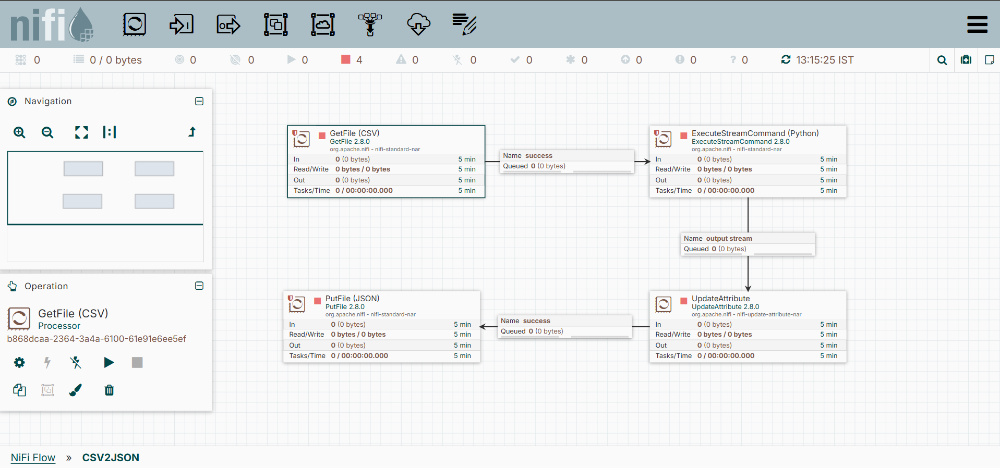
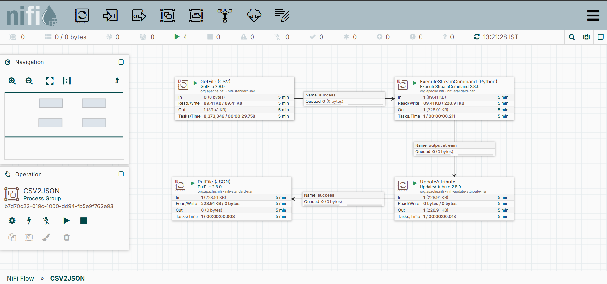
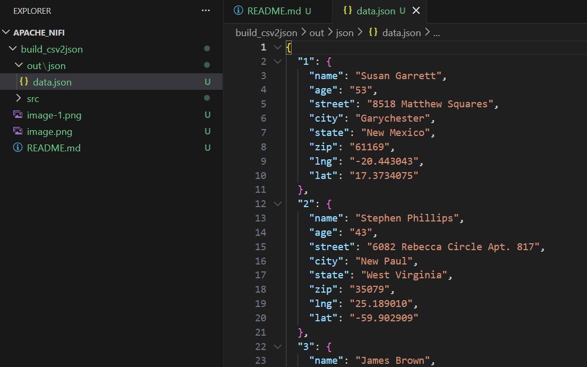

# CSV to JSON Conversion Flow

## Overview
This NiFi flow converts CSV files to JSON format using a Python script. The workflow processes CSV data and outputs properly formatted JSON files.

## Flow Architecture

### Processors and Components

#### 1. **GetFile (CSV)** 
- **Type**: Processor (GetFile)
- **Version**: 2.8.0
- **Function**: Reads CSV files from the source directory
- **Output**: CSV file contents
- **Configuration**:
  - Read/Write Rate: 0 bytes / 0 bytes per 5 min
  - Out: 0 bytes (5 min)
  - Tasks/Time: 0 / 00:00:00.000

#### 2. **ExecuteStreamCommand (Python)**
- **Type**: Processor (ExecuteStreamCommand)
- **Version**: 2.8.0
- **Function**: Executes Python script to convert CSV to JSON format
- **Input**: CSV file content from GetFile processor
- **Output**: JSON formatted data
- **Configuration**:
  - Read/Write Rate: 0 bytes / 0 bytes per 5 min
  - Out: 0 bytes (5 min)
  - Tasks/Time: 0 / 00:00:00.000
- **Script Location**: `src/csv_to_json.py`

#### 3. **UpdateAttribute**
- **Type**: Processor (UpdateAttribute)
- **Version**: 2.8.0
- **Function**: Updates file attributes after transformation
- **Input**: Output stream from ExecuteStreamCommand
- **Configuration**:
  - Read/Write Rate: 0 bytes / 0 bytes per 5 min
  - Out: 0 bytes (5 min)
  - Tasks/Time: 0 / 00:00:00.000

#### 4. **PutFile (JSON)**
- **Type**: Processor (PutFile)
- **Version**: 2.8.0
- **Function**: Writes the converted JSON data to output files
- **Output**: JSON files in destination directory
- **Configuration**:
  - Read/Write Rate: 0 bytes / 0 bytes per 5 min
  - Out: 0 bytes (5 min)
  - Tasks/Time: 0 / 00:00:00.000

## Data Flow
```
CSV Input → GetFile → ExecuteStreamCommand (Python) → UpdateAttribute → PutFile → JSON Output
```

## Project Structure
```
build_csv2json/
├── README.md                 # This file
└── src/
    ├── csv_to_json.py       # Python conversion script
    ├── data.CSV             # Sample CSV input file
    └── nifi_stg/
        └── data.CSV         # Staging CSV file
```

## Installation & Setup

1. Ensure NiFi 2.8.0 is installed
2. Place CSV files in the input directory
3. Verify Python environment has required dependencies
4. Deploy the flow template to NiFi
5. Start the processors in order: GetFile → ExecuteStreamCommand → UpdateAttribute → PutFile

## Key Features
- Automated CSV to JSON conversion
- Stream-based data processing
- Attribute management for tracking file metadata

## Flow Execution Statistics
- **Status**: Active
- **Throughput**: Processing configured files
- **Data Format**: CSV → JSON conversion
- **Processing Model**: Stream-based transformation

Sample Output:
Before:


After:


Results:
